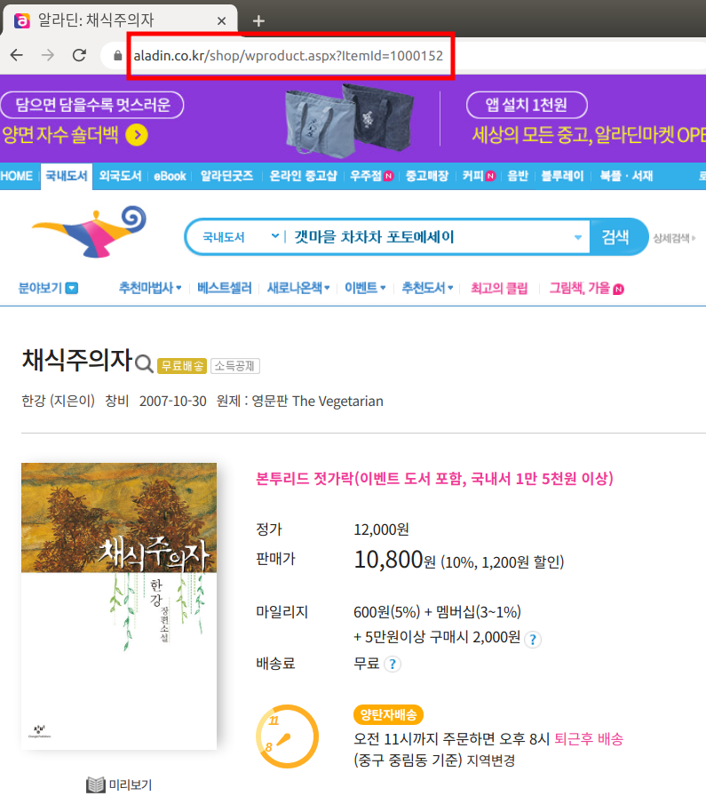

# aladin-optimizer

## 왜 만들었는가

비싼 책 값 때문에 알라딘 중고매장을 많이 이용한다. 예전에는 매장에 직접 가서 사야했지만 언젠가부터 온라인 배송을 해주기 시작해서 더 편리하기까지 하다. 그러나 배송비를 할인 받으려면 한 매장에서 2만원 이상 구매해야하는데 이것 때문에 조금 귀찮았다.

내가 사고 싶은 책이 여러 권일 때 각각의 책을 어떤 매장에서 파는지는 책마다 다를 것이다. 예를 들어 '채식주의자'라는 책은 A, B, C 매장에서 판매하고 '넛지'라는 책은 B, C, D 매장에서 판다고 해보자. 배송비를 아끼기 위해서는 B 매장에서 두 권을 구매하거나 C 매장에서 두 권을 구매해야한다. 한가지 더 고려해야 할 점은 책의 상태마다 가격이 다르기 때문에 같은 책이더라도 매장마다 가격이 다르다는 것이다. 따라서 B와 C 중에 책 가격의 합이 2만원을 넘는 매장을 선택해야 한다.

최근에 최적화에 대해 공부하면서 이 문제가 Convex Optimization 문제라는 것을 알게 되었다. 목적 함수는 살 수 있는 책의 수이고 제약 조건은 다음과 같다.

1. 각 책은 한 권만 구매한다.(같은 책을 여러 권을 구매하는 경우는 사실상 없어서 제외하였다.)
2. 어떤 매장을 이용한다면 그 매장에서 2만원 이상 사용해야한다.

원래는 이 문제를 cvxpy를 이용해 풀려고 했지만 or-tools라는 구글에서 만든 최적화 라이브러리가 있길래 호기심에 사용해보았다.

## 어떻게 사용하는가



1. 알라딘에서 사고자 하는 책들을 검색한 후 책의 URL들을 알아낸다.

2. 필요한 라이브러리들을 설치한다.
```sh
$ python3 -m venv venv
$ . venv/bin/activate
(venv) $ pip install -r requirements.txt
```

3. 두가지 방법으로 프로그램을 실행할 수 있다.
    - 책들의 URL들을 인자로 사용해 'main.py' 파일을 실행한다.
    ```sh
    (venv) $ python3 main.py https://www.aladin.co.kr/shop/wproduct.aspx?ItemId=16294019 https://www.aladin.co.kr/shop/wproduct.aspx?ItemId=86321510 https://www.aladin.co.kr/shop/wproduct.aspx?ItemId=14163562 https://www.aladin.co.kr/shop/wproduct.aspx?ItemId=188276096 https://www.aladin.co.kr/shop/wproduct.aspx?ItemId=1000152
    ```

    - URL들이 많고 길어 불편하다면 텍스트 파일에 넣어 사용해도 된다. 이때는 텍스트 파일의 이름에 '@'을 붙여 인자로 넣어준다.
    ```sh
    (venv) $ cat test_urls.txt
    https://www.aladin.co.kr/shop/wproduct.aspx?ItemId=16294019
    https://www.aladin.co.kr/shop/wproduct.aspx?ItemId=86321510
    https://www.aladin.co.kr/shop/wproduct.aspx?ItemId=14163562
    https://www.aladin.co.kr/shop/wproduct.aspx?ItemId=188276096
    https://www.aladin.co.kr/shop/wproduct.aspx?ItemId=1000152
    (venv) $ python3 main.py @test_urls.txt
    ```

    - '-q' 옵션으로 책들의 최소 품질을 설정할 수도 있다. '하', '중', '상', '최상' 중에 선택할 수 있으며 명시하지 않을 경우 '상'이 선택된다.
    ```sh
    (venv) $ python3 main.py @test_urls.txt -q 최상
    ```

4. 최적화된 결과가 출력된다.
```sh
(venv) $ python3 main.py @test_urls.txt
Start crawling with minimum quality 상...
Found 8 items of '굴 소년의 우울한 죽음'...
Found 13 items of '1만 시간의 재발견'...
Found 6 items of '여행의 기술'...
Found 10 items of '여행의 이유'...
Found 5 items of '채식주의자'...
End crawling...
-------------------- Optimization Result --------------------
------------------------- Solution 1 ------------------------
인천계산홈플러스점 굴 소년의 우울한 죽음 상 7000 https://www.aladin.co.kr/shop/wproduct.aspx?ItemId=210161066
인천계산홈플러스점 여행의 기술 상 6600 https://www.aladin.co.kr/shop/wproduct.aspx?ItemId=257392328
인천계산홈플러스점 여행의 이유 최상 8800 https://www.aladin.co.kr/shop/wproduct.aspx?ItemId=265655480
인천계산홈플러스점 채식주의자 최상 6900 https://www.aladin.co.kr/shop/wproduct.aspx?ItemId=274178679

-------------------------------------------------------------
```

## TODO
- [ ] 웹에 올리기
- [x] 알라딘 중고샵 지원
- [x] 블루레이도 검색 가능하게
- [ ] 총 가격 오름 차순으로 정렬
- [ ] 변수 수정 (store x book) => (store x quality x book) 